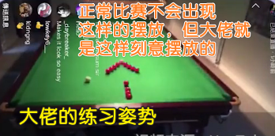
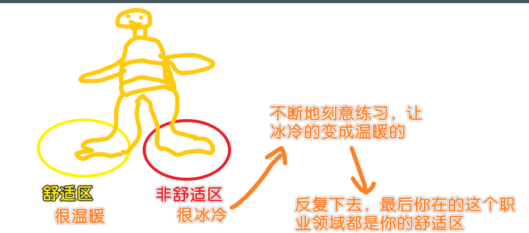
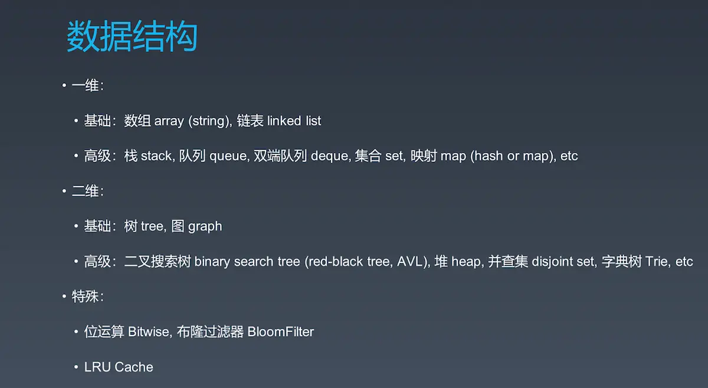
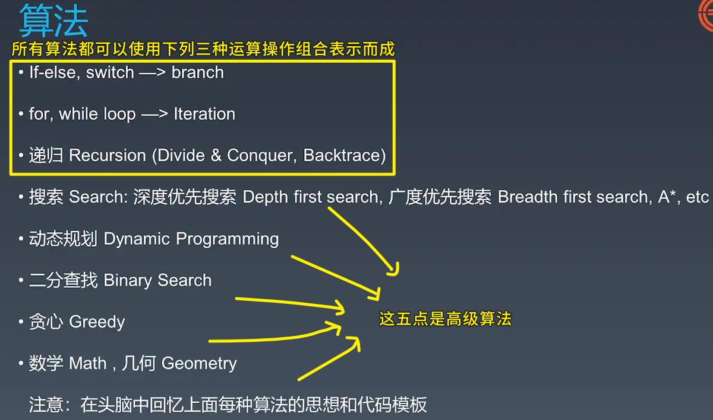

### ✍️ Tangxt ⏳ 2020-09-03 🏷️ faq

# FAQ

## 1、学习数据结构与算法的教程？

- [小浩算法 - 小浩算法](https://www.geekxh.com/0.0.%E5%AD%A6%E4%B9%A0%E9%A1%BB%E7%9F%A5/01.html)
- [练习之前，你需要了解的 - 前端算法系统练习指南](http://47.98.159.95/leetcode-js/nav/#%E9%80%82%E7%94%A8%E4%BA%BA%E7%BE%A4)

## 2、为什么要学算法？

你想要解决复杂问题，如：

- 开发一个辅助业务的脚手架工具，改造框架源码来提高项目的扩展性
- 面对严重的性能问题能马上分析出原因，然后给出解决的思路并在不同因素中平衡
- ……

关于 Vue 源码的阅读：

你想看懂 `xxx` 源码， 那么你得了解 `yyy` 概念，以及其相应的代码

如：

- 虚拟 DOM 整个`patch`的源码：深度优先遍历 + 递归
- Vue 模板编译阶段为什么要用栈来检查标签是否正常闭合：栈
- Vue 模板编译的优化阶段，到底是怎样在从父到子深度优先遍历的过程中检查到非静态的子节点后给父节点打上标记：回溯
- `keep-alive`组件的实现：LRU 缓存淘汰算法
- ……

## 3、如何系统训练？

是：

> 链表篇、栈和队列篇、哈希表篇、二叉树篇、字典树、并查集、常见排序和查找算法、回溯算法、动态规划、贪心算法、LRU 和 LFU、字符串和正则篇

不是：

> 按照 LeetCode 上的顺序一题一题刷

## 4、关于刻意练习？

> 走出自己的舒适圈！

1. 经常性地做你不会做的题
2. 多种解法方式轮流试，最大化地挖掘一道题的价值

关于练习的本质：是「练」，而不是一直做简单题，一直做你会的题，然后得到所谓的「AC」

> Accepted，在信息学竞赛中使用 Accepted 表示程序通过评测，即程序得到满分，简称 AC

## 5、数据结构与算法总览？

学习目标？

- 对于算法和数据结构理解达到职业顶尖级别
- 一线互联网公司面试
- Leetcode 300+ 积累

> 通过刻意练习，你一看到某道题目，你就能很快知道方法一是什么，方法二是什么，方法三又是什么……然后马上把代码模板给写出来！ -> 能到达这样的效果，那就能证明你的「算法与数据结构」内功已经慢慢开始积累起来了……

---

如何精通一个领域？（职业训练，三步走） -> 学习方法

- Chunk it up 切碎知识点：学会使用脑图对知识点进行切分（庖丁解牛、脉络化）
- Deliberate Practicing  刻意练习：刻意练习 – 过遍数 （五毒神掌的方法）
- Feedback 反馈（主动式、被动式）
  - 即时反馈：通过做题过程获取知识
  - 主动型反馈（自己去找）
    - 高手代码 （Github，LeeCode等）
    - 观看大佬写代码、职业选手第一视角直播（坐在屏幕面前的你，看看faker是如何玩某个英雄的，从中你可以学到这个地方有一个最佳实践以及最佳操作等等，你内心的独白：「哦！原来可以这样啊！我之前走了很多弯路了呀！」）
  - 被动式反馈（高手给你指点）
    - code review
    - 请别人观看我的代码，给我一些反馈

---

关于算法与数据结构的练习，我们该如何刻意练习？

> 谨记：**做算法题的最大误区：只做一遍！**

- 反复练习
- 过遍数（五毒神掌）: 五遍刷题法（任何一个题目做五遍或者至少做五遍）
  - 切题四件套（练习和面试时需要的做题过程）
    - Clarification 看到题时和面试官多确认几遍，保证自己理解没错
    - Possible Solutions 想所有可能的解法，过一遍，从中找出最优的解法（一般是时间最快的方法）
      - compare (time/space)
      - optimal (加强)
    - Coding (多写)
    - Test cases (多测一些测试样例，有始有终，确保代码能得到我们所期望的结果)
  - 刷题第一遍：
    - 5~10分钟读题加思考（不要超过15分钟）
    - 想不出来，不知道怎么做，那你就**直接看解法**（不用去发明创造，大部分人都是复读机，能创新的终究是极少数人做的）。注意！多解法，比较解法优劣
    - 背诵、默写好的解法（**很重要**）
  - 刷题第二遍：
    - 马上自己写（**闭卷考试**，不要看他人的解法） -> 提交到leetcode反复debug至通过
    - 多种解法比较、体会 -> 优化。 leetcode有统计执行时间（**最重要的是执行时间**）和内存消耗
  - 刷题第三遍
    - 过了一天（24小时）之后，回过头来把昨天做过的题再重新做一遍
    - 不同解法的熟练程度 -> 对不熟练的那些题再进行**专项练习**
  - 刷题第四遍
    - 过了**一周**再反复回来练习相同题目，同时对于不熟练的题目再进行专项练习
    - 四遍过完，基本上，对某一类的题目就比较熟练了！
  - 刷题第五遍
    - 如果你有面试，那么面试前一周进行恢复性训练，也就是把之前做的题再做一遍，当然，面试前一周再看不是固定要求，这得看你的面试情况，可以是面试前两周，也可以面试前半周……
- 练习弱点

> 谨记：过遍数！！方可走远！！！

上边刻意练习的生活化例子：

关于职业化运动：

1. 基本功是区分业余和职业选手的根本（深厚功底来自于--**过遍数**）
2. 基础动作的分解训练和反复练习（最大的误区是题只刷一遍就完事儿了，就像是你练习打兵乓球，一个简单的挥拍动作你都得练习成千上万次，而这样做是为了能做到肌肉记忆，最后达到条件反射）
3. 刻意练习-过遍数（五毒神掌）
4. 练习缺陷、弱点的地方（哪里弱就补哪里，直到没有明显的弱点），这可能会极大的让你感到不舒服、不爽、枯燥，但是说明在成长。
5. 生活中的例子：乒乓球、台球、游戏、滑雪、篮球…… -> 游戏打得好，如 LOL，有机地拆开它，如把补兵练好、把视野怎么做练好等等；篮球打得好，如老詹的技术成长，如不断地听取他人意见，并把自己的想法用到比赛中去、低位背身单打（可突，可转身后撤步中途）、无球攻框、转换进攻（快攻）、三分能力、扣篮、追人式盖帽、传球、防守、长久以来的身体保养……

把基本功练好，当你面对各种复杂的场景，你就能很快速地想出方案并解决之…… -> 所谓刻意练习的「刻意」，指的是，如：

我们刷的那些经典算法题也是刻意去刷的（很枯燥），在真实开发中，大概率不会出现题里边所描述的那种情况下，但我们刻意刷题，是可以做到举一反三，然后把其中的思想、套路用到我们的真实开发中去的！ -> 基础好，项目开发事半功倍！

一只脚站在舒适区，另一只脚踏出舒适区：

---

在练习前，先看看「数据结构与算法」的知识体系（切碎知识点）：

> 脑图：[数据结构](https://naotu.baidu.com/file/b832f043e2ead159d584cca4efb19703?token=7a6a56eb2630548c)、[算法](https://naotu.baidu.com/file/0a53d3a5343bd86375f348b2831d3610?token=5ab1de1c90d5f3ec)

数据结构三大块：

- 数据结构学完后，你要明确知道一些数据结构的特点，如栈先进后出，队列先进先出…… - 二维的数据结构都是由一维泛化而来的 -> 简单理解一维链表分叉，就成了树这样的二维数据结构！
- 高级数据结构 -> 在树的基础上加了很多的**特殊判断和约定条件**，如二叉搜索树就是它的根节点大于它的左子树且小于它的右子树的全部节点，然后以此有序地类推下去

算法八大点：

- 前三点类似于几何里边的公理 -> 是算法里边最基础最基础的地方！ -> 基石 -> 高级算法化繁为简就是这三点东西
- 所有这些的复杂算法，最后其实就是找它的重复单元是什么

➹：[数据结构与算法总览 - 简书](https://www.jianshu.com/p/c27ced33552d)

➹：[【406-毕业总结】 · Issue #1476 · algorithm004-01/algorithm004-01](https://github.com/algorithm004-01/algorithm004-01/issues/1476)

➹：[01 - 数据结构与算法总览_qq_37569355的博客-CSDN博客](https://blog.csdn.net/qq_37569355/article/details/103728836)

➹：[覃超数据结构与算法7天训练营笔记 - Eiger - A young gopher](https://eiger.me/post/algo/training-classroom/)

➹：[算法学习 - 刷题入门指南](https://mdgsf.github.io/2020/02/13/algorithm-introduction/)

